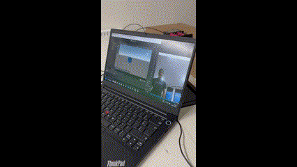

# Unity-Python Project
This project demonstrates how to control a Unity cube's position using head movements detected via OpenCV. The communication between Python (for face detection) and Unity (for rendering the cube) is achieved through a TCP connection.

## Overview

- **Python Script (`ia.py`)**: Uses OpenCV to detect the position of a face in real-time via a webcam. The detected face coordinates are sent to Unity over a TCP connection.
- **Unity Script (`TCPClient.cs`)**: Receives the face coordinates from the Python server and updates the position of a cube in the Unity scene accordingly.

## Demo



## How It Works

1. **Face Detection**:
    - The Python script uses OpenCV's Haar Cascade to detect faces in the webcam feed.
    - The coordinates of the detected face are sent to Unity via a TCP socket.

2. **Unity Cube Movement**:
    - The Unity script listens for incoming data from the Python server.
    - The cube's position is updated based on the received face coordinates.

## Setup Instructions

### Prerequisites

- Python 3.x
- OpenCV (`pip install opencv-python`)
- Unity (tested with version 2021 or later)

### Steps

1. Clone the repository:
    ```bash
    git clone https://github.com/your-repo/Unity-Python.git
    cd Unity-Python
    ```

2. **Python Setup**:
    - Navigate to the `Python` folder.
    - Run the Python script:
      ```bash
      python ia.py
      ```

3. **Unity Setup**:
    - Open the Unity project located in the `Unity-Python-Project` folder.
    - Attach the `TCPClient.cs` script to a GameObject (e.g., the cube).
    - Play the Unity scene.

4. Ensure the Python server is running before starting the Unity scene.

## Notes

- The Python server runs on `127.0.0.1:5005`. Ensure the Unity client connects to the same address and port.
- Press `q` in the Python script to stop the webcam feed and close the server.

## License

This project is licensed under the MIT License. See the `LICENSE` file for details.

Enjoy moving the cube with your head! 🎉  